## Smell Trends Over LOC

The below chart displays trends for all the different types of smells with the increase of Lines of Code(LOC) over the span of the organization. The LOC have been growning exponentially, whereas, smell counts have been growning gradually for Axelor Open Suite. However, there was a concerning spike last year(April 22-23).

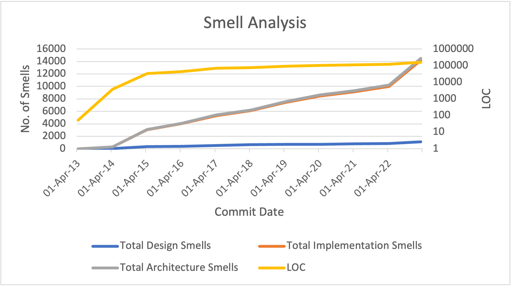*Figure 1. Design, Implementation and Architecture Smells over LOC*

### Design Smells Over LOC

As the organization's life is concerned, the design smells has increased over the time. With introduction of new product line-ups and new features down the line, the number of smells might have increased. Also, considering potential hand-overs from various developers, it is a natural trend for this increase. (Seems a lot like making assumptions)

Apart from above stated reasons, there are certainly many technical reasons to this cause [1]. Refer [this link](https://www.tusharma.in/smells/DESIGN.html) to get more insights on various design smells.

However, these numbers skyrocketed during the initial development during April 2014-15  and last year i.e. April 2022-23. Surprisingly, it remained almost same during April 2019-20 concluding that the developers managed to write quality code.

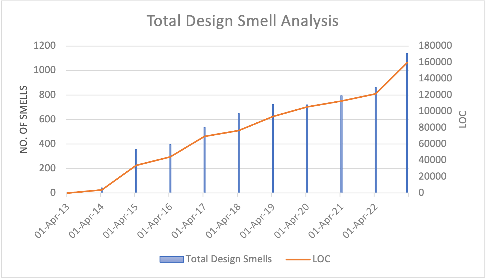*Figure 2. Total Design Smells plotted over LOC*

### Implementation Smells Over LOC

Implementation smell gradually increased as the project progressed. However, these numbers skyrocketed during the initial development(i.e. between 2014-15) and last year(i.e. between 2022-23).

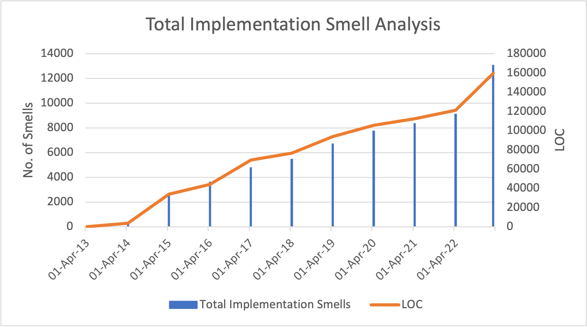*Figure 3. Total Implementaiton Smells plotted over LOC*

There are various common causes like choosing inappropriate attribute names, field types, using temporary fields for workarounds, using magic numbers, etc [2]. These could largely impact readability, maintainability and reusability of software. Refer [this link](https://www.tusharma.in/smells/IMPL.html) to get more insights on various implementation smells.

### Architecture Smells Over LOC

The trend for increase in architecture smells was gradual. There was significant increase during April 2014-15 and April 2022-23 which is visible in Figure 4.

Remarkably, developers managed to write code that hardly introduced new architetural smells during April 20-21(see Figure 4).

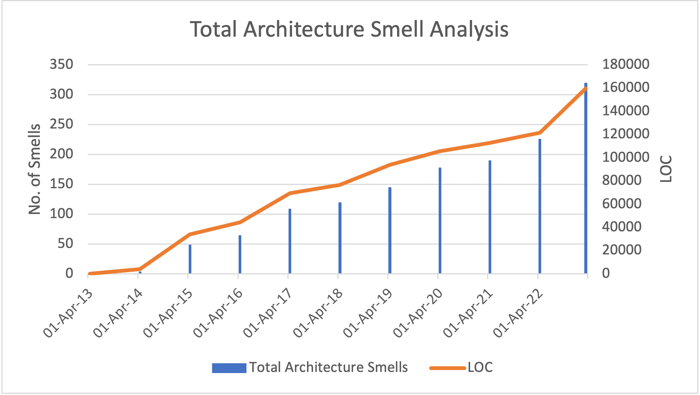*Figure 4. Total Architecture Smells plotted over LOC*

Various common contributors to these smells are overgeneralization, feature concentration, reinvent the wheel, etc [3]. These smells usually occur at module or package level. Refer [this link](https://www.tusharma.in/smells/ARCH.html) to get more insights on various architecture smells.

#### Conclusion

After analysing all the trends for all the different types of smells - Design, Implementation and Architecture - their degree of correlation can be taken into consideration. They all had significant increase during same periods during organization's life.

Overall, smells has increased over the time and the reason can be verified by closer and fine-grained analysis. The recent spike in smell could be due to poor code quality or efforts towards refactoring it which can be revealed on detailed evaluation.

Opting specific refactoring techniques during early phase of project can save a lot of resources and technical debts for any organization.

## Overall Smell Densities Trends Over A Decade

Smell densities for different types of smells varies over the organization's life(see Figure 5). Implementation and architecture smell densities has grown over time. However, design smell density has decreased over the time.

Smell density is smells per KLOC and it can be calculated using following formula:\
$(Number \space of \space smells)*1000/LOC$

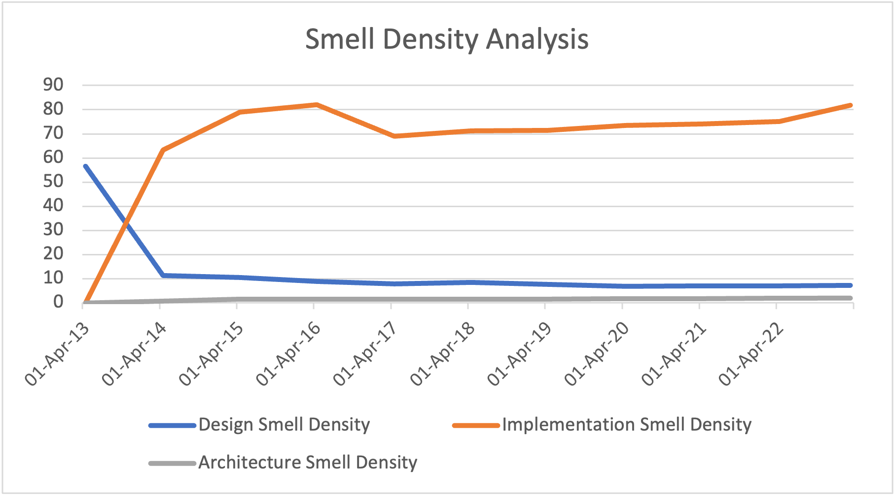*Figure 5. Design, Implementation and Architecture Smell Densities as the organization grows*

The trends in logarithmic scale as shown in Figure 6 suggests that all kinds of smell densities had either spiked or dipped at initial stages of the organization. Thereafter, it's increasing at slow rate.

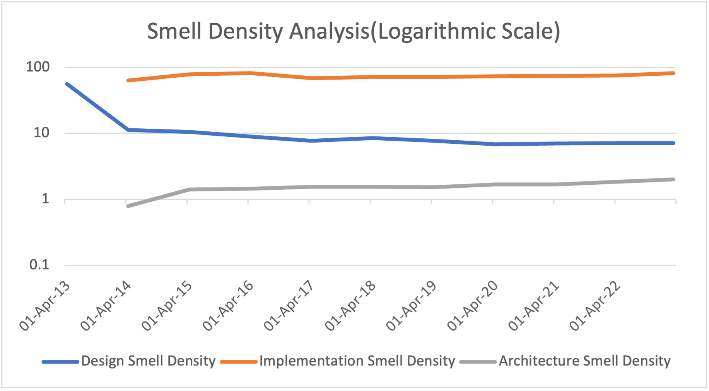*Figure 6. Design, Implementation and Architecture Smell Densities in logarithmic scale as the organization grows*

### Design Smell Density

During the early stage of the project, the codebase undergoes new additional lines of code and refactorings causing it to have increased design smell density. It drops rapidly during the first year which reduced very slowly for the rest of the project life.

Design Smell Density can be calculated using following formula:\
$(Number \space of \space design \space smells)*1000/LOC$

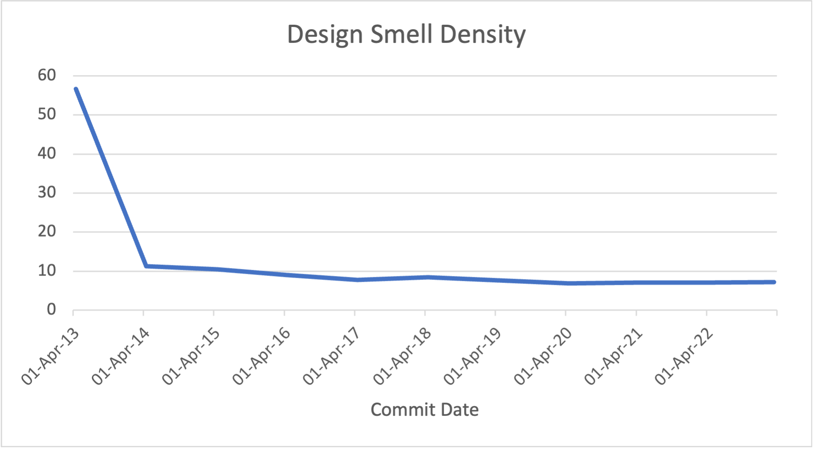*Figure 7. Total Design Smell Density as the organization grows*

### Implementation Smell Density

Implementation Smell Density skyrocketed during early stage of the project. After that, the growth was gradual over the lifetime of the organization. The reason for this trend might be due to introduction of new codebase and frequent change in designs during initial phase.

However, it dipped during April 2016 and April 2017 indicating that the developers managed to write code with higher quality.

Implementation Smell Density can be calculated using following formula:\
$(Number \space of \space implementation \space smells)*1000/LOC$

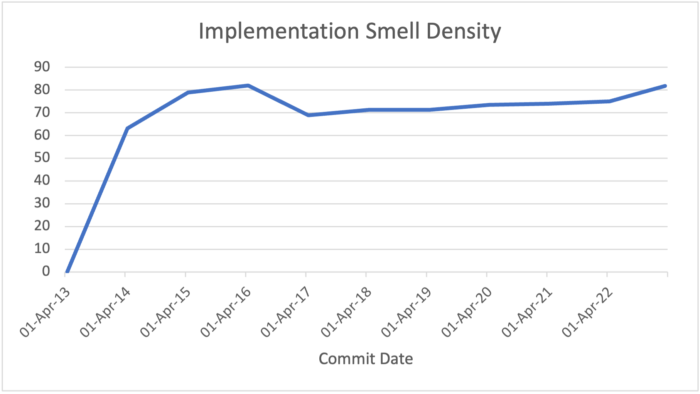*Figure 8. Total Implementation Smell Density as the organization grows*

### Architecture Smell Density

Similar to Implementation Smell Density, Architecture Smell Density has increased significantly during intial phase of the organization. After April 2015, the growth was gradual and at slow rate.

Architecture Smell Density can be calculated using following formula:\
$(Number \space of \space Architecture \space smells)*1000/LOC$

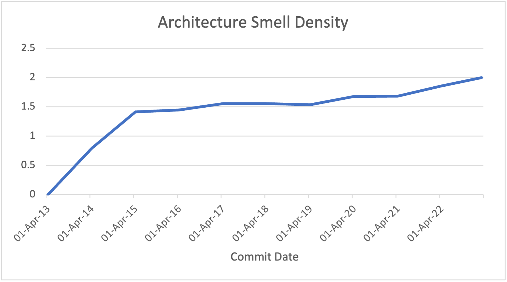*Figure 9. Total Architecture Smell Density as the organization grows*

## Overall Lack of Cohesion of Methods(LCOM) Trends Over A Decade

LCOM is the metric defining the correlation between the methods and the instance variable of the class. Lower the value of LCOM, higher the cohesion between methods. This directly implies that they follow Single Responsibility Principle.

As illustrated in Figure 10, LCOM at initial stage of the organization was 1, however, it dropped rapidly during the first year and remained low(0.2-0.3) for the rest of the organization's life. Ideally, the threshold is 0.8 and lower value is always desired.

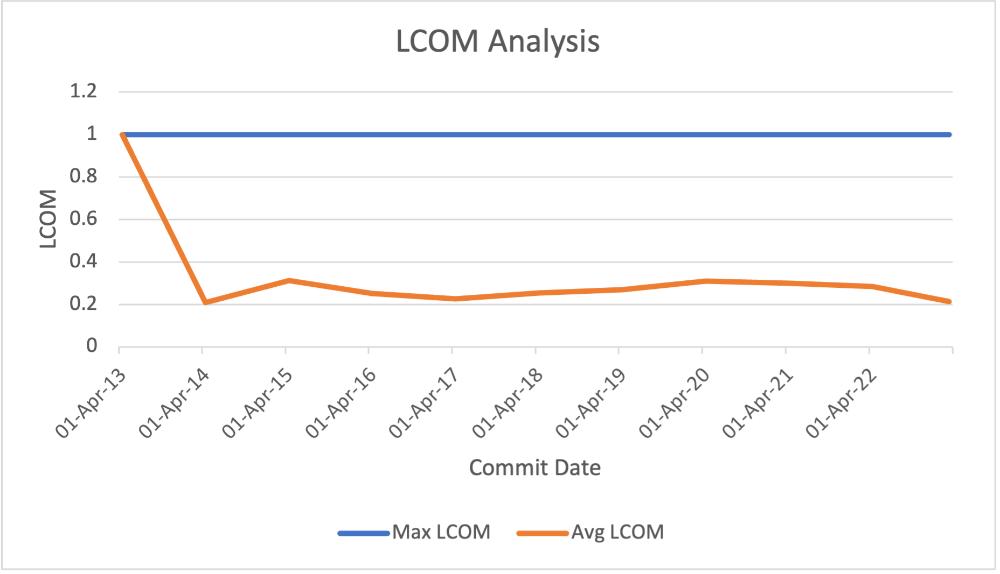*Figure 10. Changes of Lack of Cohesion of Methods(LCOM) as the organization grows*

Individual charts for average and maximum LCOM values are showcased by figure 11 and 12 respectively.

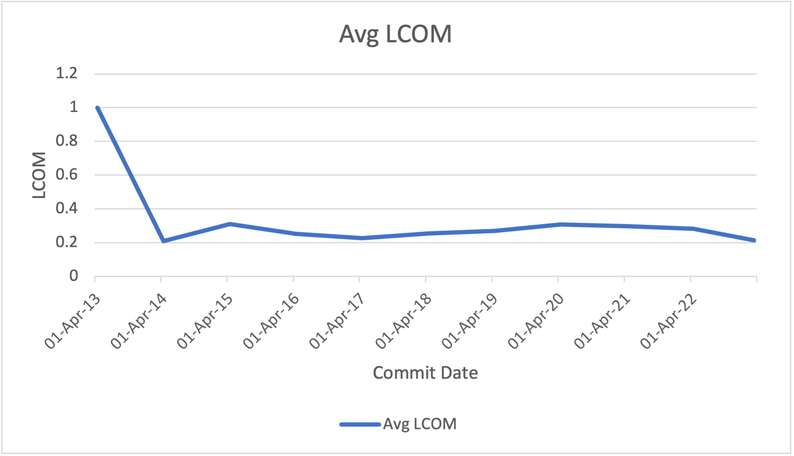*Figure 11. Plot showing decrease in average LCOM as the organization grows*

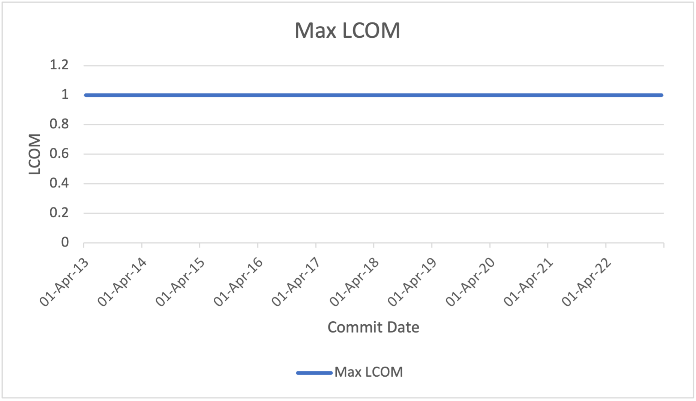*Figure 12. Plot showing maximum LCOM as the organization grows*

## Overall WMC Trends Over A Decade

Weighted Methods per Class(WMC) is the metric that measures sum of cyclomatic complexities of all the methods present in a class. Higher the number of cyclomatic complexities, higher the number of tests required to cover all the possible paths. The ideal threshold for this metric is 100. Higher number implies potential reduction in maintainability and testability of a software.

As shown in figure 13 and 15, the maximum value for WMC detected from all the class has been increasing. Apart from spike during initial phase, it has been gradual so far.

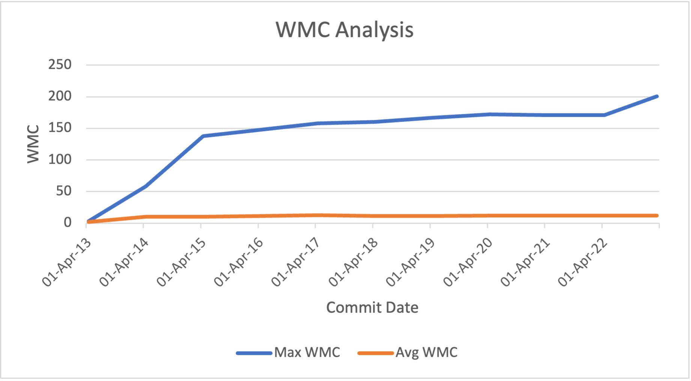*Figure 13. Plot illustrating trends of WCM as the organization grows*

Figure 14 illustrates the average WMC during organization's life so far. Lower average values suggest lower cyclomatic complexities. Additionally, it has been constant i.e. 12 which is quite lower than the suggested threshold. However, maximum WMC has exceeded the threshold during initial development phase.

Increasing maximum WMC values would be because to the classes having higher fan-outs. Closer inspection might reveal accurate results.

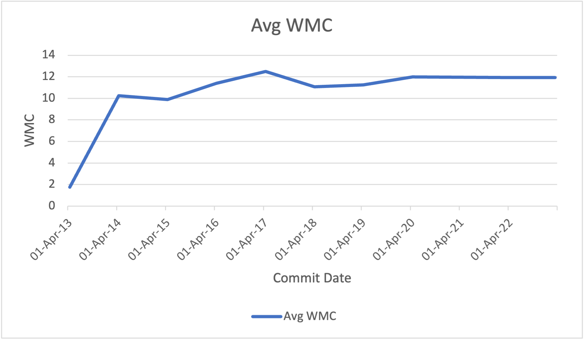*Figure 14. Plot illustrating average value of WCM as the organization grows*

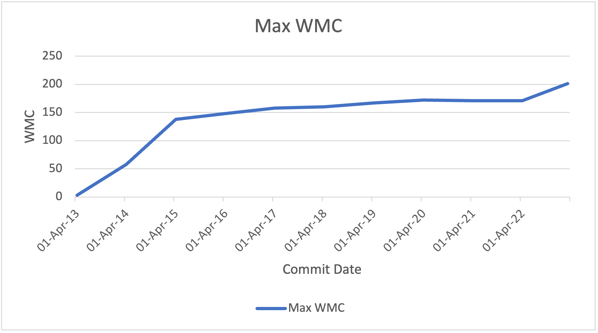*Figure 15. Plot illustrating maximum WCM as the organization grows*

As the organization grows, the WMC for entire project is expected to grow, demanding more test case, which is justified in Figure 16.

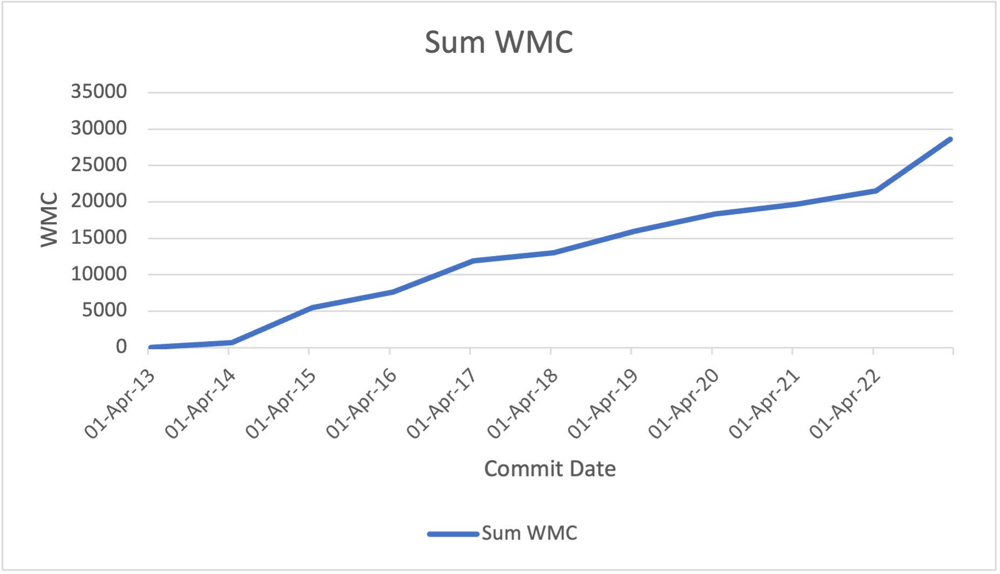
*Figure 16. Plot illustrating total number of WCM as the organization grows*

## Acknowledgements

Special thanks to [Dr. Tushar Sharma](https://www.tusharma.in/) for providing educational access to [DesigniteJava](https://www.designite-tools.com/)[4] for this analysis.

## References

[1] “A Taxonomy of Software Smells.” Available: https://www.tusharma.in/smells/DESIGN.html. [Accessed: Mar. 30, 2023]

[2] “A Taxonomy of Software Smells.” Available: https://www.tusharma.in/smells/IMPL.html. [Accessed: Mar. 30, 2023]

[3] “A Taxonomy of Software Smells.” Available: https://www.tusharma.in/smells/ARCH.html. [Accessed: Mar. 30, 2023]

[4] T. Sharma, “Designite - A Software Design Quality Assessment Tool.” Zenodo, May 31, 2016. doi: 10.5281/ZENODO.2566832. Available: https://zenodo.org/record/2566832. [Accessed: Mar. 30, 2023]

